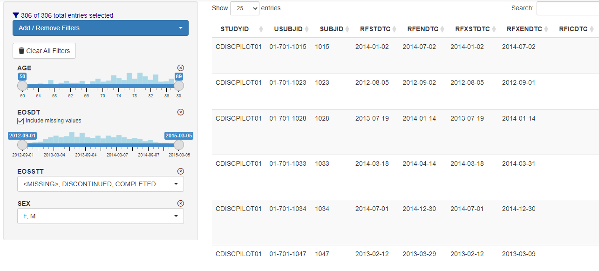

# Dynamic Data Filtering Module

## Overview

`dv.filter` provides a Shiny module to filter data frame dynamically.
It is common to use `dv.filter` together with `dv.manager` for building
interactive web applications through a modular framework.



## Installation

``` r
install.packages("remotes") # if you have not installed "remotes" package
remotes::install_github("Boehringer-Ingelheim/dv.filter")
```

## Acknowledgements

`dv.filter` draws inspiration from the work of 
[Hadley Wickham](https://mastering-shiny.org/action-dynamic.html#dynamic-filter), 
[Joe Cheng](https://github.com/jcheng5/rpharma-demo/blob/master/modules/filter_module.R), 
and [Doug Kelkhoff](https://github.com/dgkf/shinyDataFilter).
