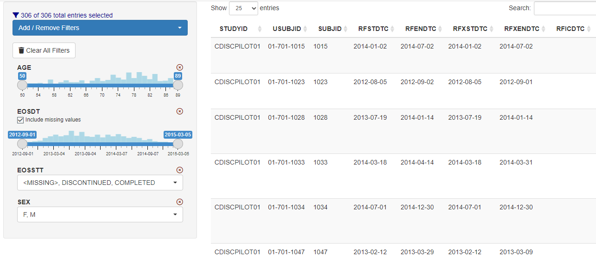

```{r setup, include = FALSE}
knitr::opts_chunk$set(
  eval = FALSE,
  collapse = TRUE,
  comment = "#>"
)
```

Run the code below to launch a demo app.

```{r, eval=FALSE}
data <- shiny::reactive(pharmaverseadam::adsl)

ui <- shiny::fluidPage(
  shiny::sidebarLayout(
    shiny::sidebarPanel(
      dv.filter::data_filter_ui("data_filter")
    ),
    shiny::mainPanel(
      shiny::dataTableOutput("data_table")
    )
  )
)

server <- function(input, output, session) {
  selected <- dv.filter::data_filter_server("data_filter", data = data)
  
  output$data_table <- shiny::renderDataTable({
    data()[selected(), ]
  })
}

shiny::shinyApp(ui, server)
```

Inside the app, `dv.filter::data_filter_ui()` and `dv.filter::data_filter_server()` 
are called to invoke the module.  

{width=100%}
